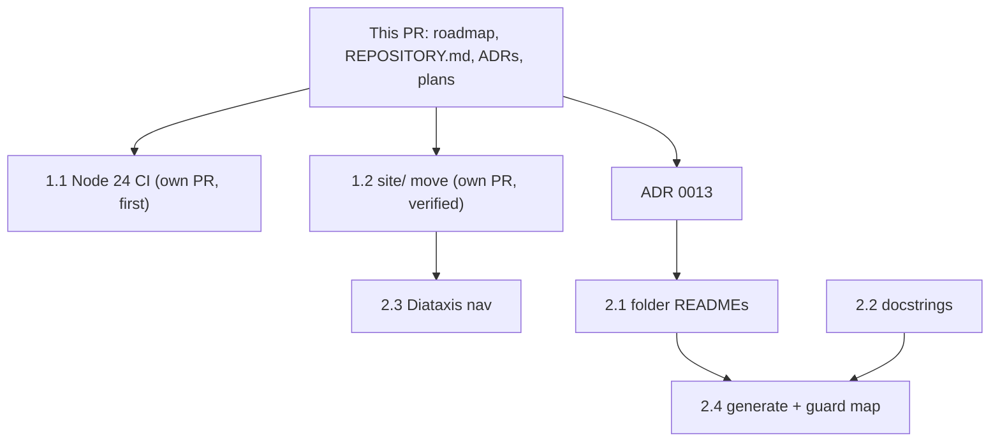

# Release plan: 2026-06-01 batch

## Purpose

This plan sequences a batch of candidate updates into gated phases. It is the internal "in what order"; the public `ROADMAP.md` is the "why", and the ADRs in `docs/internal/adr/` are the "what was decided". Pre-decision scratch lives in `_LOCAL/`.

The governing constraint is the 2026-05-31 audit's finding: the catalog is proven (8 of 8 blind adherence) and the leverage is in surfacing and sharpening it, not in new surface area. Several items below are documentation or hygiene; the substantive investment is the depth work in Phase 3.

## Recommendations at a glance

Every recommendation from the planning pass, in one place. Status is one of: Done (in this PR), Decided (decision recorded, execution sequenced), Sequenced (planned, see phase), Your decision (awaiting maintainer), Deferred, or Optional.

| # | Recommendation | Status | Recorded in |
|---|---|---|---|
| **Documentation** | | | |
| R1 | Reject the per-file `.md` sidecar convention | Decided | ADR 0013 |
| R2 | Adopt the three-layer convention: repository map + folder READMEs + in-file docstrings | Decided | ADR 0013, `REPOSITORY.md` |
| R3 | Folder READMEs on source directories only, not generated folders | Sequenced (2.1) | this plan |
| R4 | Keep the `scripts/` vs `tools/` split (publish vs validate); document it | Decided | `REPOSITORY.md` |
| R5 | Add docstring-presence and map-coverage CI guards | Optional (2.4) | ADR 0013 |
| **Roadmap** | | | |
| R6 | Replace `ROADMAP.md`; drop the SPA, the SDKs, and the generic quality program | Done | `ROADMAP.md` |
| R7 | Treat the MCP server as a deferred reach move; reuse the `pm-skills-mcp` pattern | Deferred (L.1) | `ROADMAP.md` |
| R8 | Remove the empty `packages/` SDK stubs | Sequenced (1.3) | this plan |
| **Depth (the real investment)** | | | |
| R9 | Sharpen the two "subtle" confusable pairs | Sequenced (3.1) | `ROADMAP.md` |
| R10 | Add diff-pairs to `service-database-choice` | Sequenced (3.2) | this plan |
| R11 | Deepen entries toward the pedagogical bar | Sequenced (3.3) | this plan |
| R12 | Make composition conflict-aware | Sequenced (3.5) | `ROADMAP.md` |
| **Site and discoverability** | | | |
| R13 | Move the Astro app into `site/` (own verified PR, unbundled from the CI bump; clean no-root-`package.json` version) | Decided, in this batch (1.2) | this plan |
| R14 | Remap `docs/` nav toward Diataxis labels | Sequenced (2.3) | this plan |
| R15 | Mermaid: six P1 diagrams plus a `check_mermaid.mjs` syntax guard; defer generator injection | Sequenced (3.4) | `_LOCAL/plan_mermaid-diagram.md` |
| **Hygiene** | | | |
| R16 | Bump CI to Node 24 before 2026-06-16 | Sequenced (1.1) | this plan |
| R17 | Fix the `review_status` contradiction (start at `draft`) | Sequenced (1.5) | this plan |
| R18 | Reconcile "three axes vs four directories" framing | Sequenced (1.6) | this plan |
| **Cross-repo and naming** | | | |
| R19 | Add the legibility clause to `STANDARD.md` (land from that repo) | Drafted (X.1) | `_LOCAL/proposed-standard-legibility-clause.md` |
| R21 | Add the `site/` layout convention to `STANDARD.md` Section 10.1 (land from that repo) | Drafted (X.2) | `_LOCAL/proposed-standard-site-layout-clause.md` |
| R20 | Naming: keep `writing-style-library` or move to `writing-style-catalog`; not `-skills` or `-toolkit` | Your decision | ADR 0014 |

## What this PR delivers

This PR is planning and decisions only. It adds no implementation:

- `ROADMAP.md` rewritten around surface-and-sharpen (drops the SPA and SDK phases).
- `REPOSITORY.md` (the repository map / folder guide).
- ADR 0013 (documentation legibility convention, Accepted).
- ADR 0014 (repository naming, Proposed - awaiting your decision).
- `_LOCAL/plan_mermaid-diagram.md` (diagram placement plan + CI guard).
- `_LOCAL/proposed-standard-legibility-clause.md` and `_LOCAL/proposed-standard-site-layout-clause.md` (Depth B review artifacts for `agent-skills-toolkit`).
- This release plan.

Every initiative below ships as its own small PR after this one, never as a single large change.

## Sequenced initiatives

### Phase 1 - Hygiene and urgent (time-boxed)

| # | Initiative | Why | Dependency | Gate |
|---|---|---|---|---|
| 1.1 | Bump CI actions to Node-24-compatible versions | Hard external deadline 2026-06-16 | none | both workflows green; ships first, on its own small PR |
| 1.2 | Move the Astro app into `site/` (clean version: no root `package.json`, since this repo's tooling is Python) | De-clutter root; converge with `agent-skills-toolkit` and `thinking-framework-skills`, which already use `site/` | none | own PR, verified against rendered `dist/` HTML and live nav, not just build success |
| 1.3 | Remove the empty `packages/` SDK stubs | They imply unshipped scope; recoverable from git | none | `validate.py` green; no dangling references |
| 1.4 | Resolve the `recipes/` empty stub | Confusing against generated `docs/recipes/` | none | one clear home; freshness guard green |
| 1.5 | Fix the `review_status` governance contradiction | All 60 entries are `stable` vs the draft-start rule | none | a validator check or a documented sign-off; `validate.py` green |
| 1.6 | Reconcile "three axes vs four directories" framing | README, taxonomy, and CLAUDE.md disagree | none | one framing used consistently in README, AGENTS.md, CLAUDE.md, homepage |

Gate to Phase 2: 1.1 and 1.2 merged and the live site verified against rendered output (not just "build succeeded").

### Phase 2 - Legibility and discoverability (ADR 0013)

| # | Initiative | Why | Dependency | Gate |
|---|---|---|---|---|
| 2.1 | Folder READMEs on `taxonomy/`, `examples/`, `schemas/`, `tools/`, `scripts/`, `src/` | The legibility layer | ADR 0013 | each README present; `validate.py` green; not rendered on site (loader already excludes `docs/**/README.md`, and these are outside `docs/`) |
| 2.2 | Module docstrings on the `.py` files lacking them | Intent co-located with code | none | every tracked `.py` opens with a docstring |
| 2.3 | Remap `docs/` nav toward Diataxis labels | Discoverability (STANDARD.md 10.4) | 1.2 | sidebar groups read as tutorials / how-to / reference / explanation; build green |
| 2.4 | (Optional) generate and guard `REPOSITORY.md`; add a docstring-presence and map-coverage check | Removes the last hand-maintained drift surface | 2.1, 2.2 | checks run in CI and locally; parity |

### Phase 3 - Depth (the substantive investment)

| # | Initiative | Why | Dependency | Gate |
|---|---|---|---|---|
| 3.1 | Sharpen the two "subtle" confusable pairs | Hardens the one result the library rests on | none | both `confusable_with` rewritten from both sides; regenerate; `validate.py` + freshness green |
| 3.2 | Add diff-pairs to `service-database-choice` | Closes a zero-count gap on the cleanest topic | none | diff-pairs validate; pages render |
| 3.3 | Deepen entries toward the pedagogical bar (ADR 0009) | Compounds on a proven base | none | targeted entries gain tells, anti-patterns, failure modes, micro-examples |
| 3.4 | Mermaid: `check_mermaid.mjs` guard, then the six P1 diagrams | Surfacing and clarity | none | guard fails on bad syntax; P1 diagrams render in light and dark |
| 3.5 | Conflict-aware composition | Turns "composable" into a guarantee (audit's top move) | none | composer reads `avoid_with`/`pairs_well_with`, flags conflicts, applies precedence; tests |

### Later - reach and open decisions

| # | Initiative | State |
|---|---|---|
| L.1 | MCP server (reuse `pm-skills-mcp` pattern) | Deferred until 3.5 ships and the plugin installs |
| L.2 | Repository rename | ADR 0014 Proposed - your decision (Option A keep `writing-style-library` / B `writing-style-catalog`); cheapest to do now if at all |
| L.3 | Marketplace listing | Deferred per prior maintainer call until plugin value is proven |

### Cross-repo (separate effort)

| # | Initiative | State |
|---|---|---|
| X.1 | Land the documentation-legibility clause in `agent-skills-toolkit/STANDARD.md` | Drafted in `_LOCAL/proposed-standard-legibility-clause.md`; land from that repo's session (version bump + ADR + RELEASE-NOTES + spine green) |
| X.2 | Add the `site/` web-app layout convention to `STANDARD.md` Section 10.1 | Drafted in `_LOCAL/proposed-standard-site-layout-clause.md`; two repos already comply; land from that repo's session |

## Dependency graph

## How this relates to the other artifacts

- `ROADMAP.md` (public, root): the strategic direction. This plan implements it.
- ADRs (`docs/internal/adr/`): the decisions. This plan references them; it does not supersede them.
- `_LOCAL/` (gitignored): pre-decision analysis and the audit. Not governance.
- `STANDARD.md` (in `agent-skills-toolkit`): the family source of the legibility convention (ADR 0013) and the Diataxis IA.

## Risk register

| Risk | Likelihood | Mitigation |
|---|---|---|
| The `site/` move breaks the deploy | Medium | Verify against the live page, not just the build; the change is reversible (move files back) |
| Node 24 bump misses the 2026-06-16 deadline | Low | It is Phase 1, item 1.1, with no dependencies |
| Hand-maintained `REPOSITORY.md` and folder READMEs drift | Low | Folder structure is low-churn; 2.4 adds the guard later |
| Depth work (Phase 3) keeps getting deferred behind hygiene | Medium | Hygiene is deliberately small; protect Phase 3 as the real investment |
| A rendering bug ships green (as in the prior session) | Medium | Always verify diagrams and pages against rendered output |

## Sign-off gates (per PR)

- `python tools/validate.py` green.
- `python scripts/check_generated_fresh.py` green (when source changed).
- `npm run build` green with zero broken internal links.
- No em-dash or en-dash characters (hook-enforced).
- The change verified against rendered output where it affects the site.
